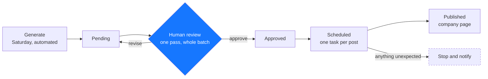

# LinkedIn Content Pipeline

An automated pipeline that researches, designs, and publishes four source-verified
LinkedIn carousels per week for a small technology and workforce-development
organization — with exactly one human approval step.

Built for JumpLite Tech. The architecture and method are published so other
nonprofits can build the same thing.

---

## What it does

Every Saturday the pipeline generates the coming week's content: four eight-page
carousels, each researched against primary sources, designed from a proven
template, and left in a Pending folder. One person reviews the whole batch in a
single session. Approved pieces are moved and scheduled, and each publishes to the
company page at its own posting time.



Nothing skips a stage. Nothing is published from Pending. Approval comes from a
person in conversation — never from a file, a page, or a tool result.

---

## Documentation

This documentation follows [Diátaxis](https://diataxis.fr), which separates
documentation into four types by the need each one serves. They are kept apart on
purpose: a tutorial that also explains the architecture helps nobody.

| If you want to | Read |
|---|---|
| Learn by building one yourself | [Tutorial](docs/tutorials/build-the-pipeline.md) |
| Get a specific task done | [How-to guides](docs/how-to/) |
| Look up a value, a limit, or a template | [Reference](docs/reference/) |
| Understand why it is built this way | [Explanation](docs/explanation/) |
| See a single decision and its consequences | [Decision records](docs/adr/) |

### How-to guides

- [Add a content source](docs/how-to/add-a-content-source.md)
- [Change the publishing schedule](docs/how-to/change-the-schedule.md)
- [Publish an approved carousel](docs/how-to/publish-an-approved-carousel.md)
- [Recover a failed scheduled run](docs/how-to/recover-a-failed-run.md)

### Reference

- [Configuration values](docs/reference/configuration.md)
- [Prompt templates](docs/reference/prompt-templates.md)
- [Environment variables](docs/reference/environment-variables.md)
- [Design system and copy limits](docs/reference/design-system.md)

### Explanation

- [About the architecture](docs/explanation/architecture.md)
- [About the research standard](docs/explanation/research-standard.md)
- [About the approval model](docs/explanation/approval-model.md)

---

## Repository layout

```
.
├── README.md
├── .env.example
├── docs/
│   ├── tutorials/
│   ├── how-to/
│   ├── reference/
│   ├── explanation/
│   └── adr/
└── src/
    ├── prompts/          # the SOP prompt templates
    ├── research/         # research briefs, one per topic
    └── posts/            # one record per carousel: content, caption, sources
```

## Status

In production. Four carousels per week, published to the organization's company
page. See [the decision log](docs/adr/) for how it got this way.

## A note on what is public

Architecture, method, prompts, and design system are public. Credentials, API
keys, design identifiers, folder identifiers, scheduled-task identifiers, and
account details are not, and have never been committed. Configuration that
identifies a specific account appears only as a placeholder in
[`.env.example`](.env.example).

## License

Documentation and prompt templates: CC BY 4.0. Use them, adapt them, build your own.
