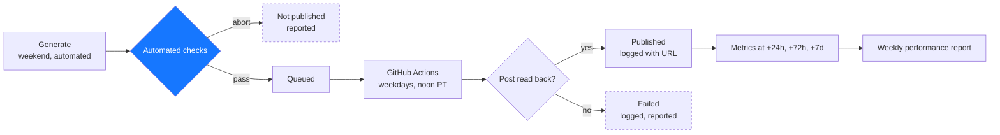

# LinkedIn Content Pipeline

An automated pipeline that researches, designs, verifies, and publishes five
source-verified LinkedIn carousels per week for a small technology and
workforce-development organization — with no human step in the publishing path.

Built for JumpLite Tech. The architecture and method are published so other
nonprofits can build the same thing.

---

## What it does

Every weekend the pipeline generates the coming week's content: five eight-page
carousels, each researched against primary sources and designed from a proven
template. Each one is run against a set of automated checks. Those that pass are
queued; those that fail are aborted and reported. A scheduled job publishes one
queued carousel each weekday at noon, confirms it went live, and records the result.


```mermaid
flowchart LR
    A[Generate<br/>weekend, automated] --> B{Automated checks}
    B -->|abort| X[Not published<br/>reported]
    B -->|pass| C[Queued]
    C --> D[GitHub Actions<br/>weekdays, noon PT]
    D --> E{Post read back?}
    E -->|yes| F[Published<br/>logged with URL]
    E -->|no| G[Failed<br/>logged, reported]
    F --> H[Metrics at +24h, +72h, +7d]
    H --> I[Weekly performance report]

    style B fill:#1677FF,color:#fff
    style X stroke-dasharray: 4 4
    style G stroke-dasharray: 4 4
```

A run that fails any abort condition publishes nothing. A run that publishes but
cannot read the post back is logged as **Failed**, never as Published.

---

## Documentation

This documentation follows [Diátaxis](https://diataxis.fr), which separates
documentation into four types by the need each one serves. They are kept apart on
purpose: a tutorial that also explains the architecture helps nobody.

| If you want to | Read |
|---|---|
| Learn by building one yourself | [Tutorial](docs/tutorials/build-the-pipeline.md) |
| Get a specific task done | [How-to guides](docs/how-to/) |
| Look up a value, a limit, or a template | [Reference](docs/reference/) |
| Understand why it is built this way | [Explanation](docs/explanation/) |
| See a single decision and its consequences | [Decision records](docs/adr/) |

### How-to guides

- [Add a content source](docs/how-to/add-a-content-source.md)
- [Change the publishing schedule](docs/how-to/change-the-schedule.md)
- [Publish by hand](docs/how-to/publish-by-hand.md)
- [Recover a failed run](docs/how-to/recover-a-failed-run.md)
- [Collect performance metrics](docs/how-to/collect-performance-metrics.md)

### Reference

- [Configuration values](docs/reference/configuration.md)
- [Prompt templates](docs/reference/prompt-templates.md)
- [Environment variables](docs/reference/environment-variables.md)
- [Design system and copy limits](docs/reference/design-system.md)
- [Metrics schema](docs/reference/metrics-schema.md)

### Explanation

- [About the architecture](docs/explanation/architecture.md)
- [About the research standard](docs/explanation/research-standard.md)
- [About the verification model](docs/explanation/verification-model.md)
- [About the analytics](docs/explanation/analytics.md)

---

## Repository layout

```
.
├── README.md
├── .env.example
├── .github/workflows/
│   └── publish.yml       # the weekday publishing job
├── publisher/
│   └── publish.py        # upload, post, read back, commit status
├── queue/
│   └── queue.json        # one entry per weekday
├── docs/
│   ├── tutorials/
│   ├── how-to/
│   ├── reference/
│   ├── explanation/
│   └── adr/
└── src/
    ├── prompts/          # the SOP prompt templates
    ├── research/         # research briefs, one per topic
    └── posts/            # one record per carousel: content, caption, sources
```

## Status

Five carousels per week, weekdays at 12:00 PT. The publishing job runs on GitHub
Actions against the platform's organization API; it is pending API approval, with a
browser route as the documented fallback. See [the decision log](docs/adr/) for how
it got this way.

## A note on what is public

Architecture, method, prompts, and design system are public. Credentials, API keys,
design identifiers, organization identifiers, and account details are not, and have
never been committed. Publishing secrets live in the CI provider's secret store;
placeholders are in [`.env.example`](.env.example).

## License

Documentation and prompt templates: CC BY 4.0. Use them, adapt them, build your own.
