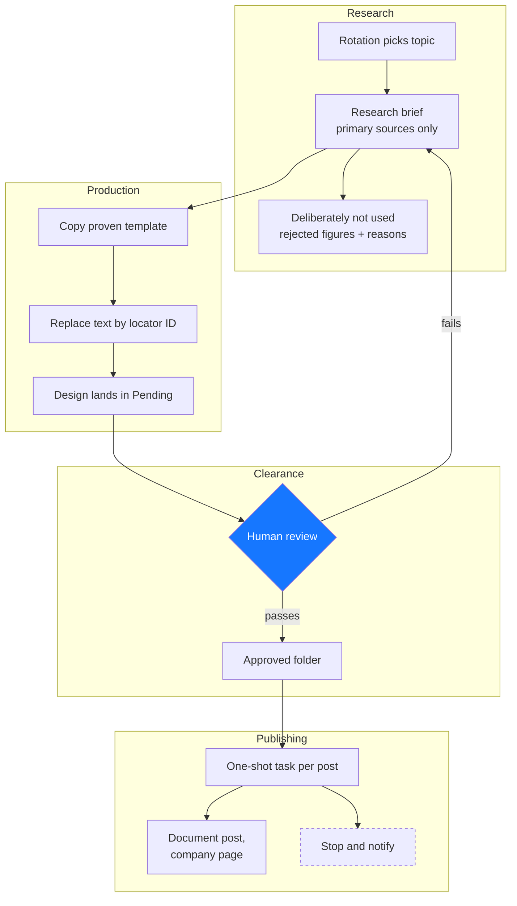

# About the architecture

This page is about why the pipeline is shaped the way it is, and what constrained
it. It is not a guide to operating it — for that, see the
[how-to guides](../how-to/).

## The problem it was built against

A small technology and workforce-development organization needs to be visible on
LinkedIn, and sells technology judgement rather than a product. That combination is
unusually unforgiving. A content pipeline that publishes consistently but says
nothing is a slow reputational cost. One that publishes an invented statistic is a
fast one.

There was no content team, no designer, and no budget to hire either. So the design
problem was not "how do we make content" but "how do we make credible content
repeatably, with one person's attention as the scarce resource."

Almost every structural decision follows from treating human review as the thing to
economize, rather than machine time.

## The shape

Four stages, one gate. Work moves in one direction, and the only backward edge runs
from review to research — not from review to design. That edge placement is
deliberate and is discussed below.

## Research before design, and why the arrow points where it does

The obvious pipeline puts research and writing together, then design, then review,
with review sending work back to whoever wrote it.

We separated research into its own artifact with its own standard, and made failed
review send work back to the *brief* rather than the draft. The reason is that
almost every real review failure is a sourcing failure wearing a copywriting
costume. A claim reads as overstated because the underlying figure does not support
it. Fixing the sentence hides the problem; fixing the brief removes it.

The **Deliberately not used** section is the part of this I would carry to any other
project. It is a list of figures that were tempting and were rejected, with reasons.
Without it, a rejected claim comes back. Someone finds the same attractive number six
weeks later, has no memory of the earlier decision, and uses it. Institutional memory
about what is *not* true is much harder to maintain than memory about what is, and
it is the kind that protects you.

More on this in [About the research standard](research-standard.md).

## Templates rather than generation

The first instinct was to have the design generated fresh each time from a
description. That failed, and the failure is worth recording precisely because it
looked like it should work.

Asking a design generator to produce a page containing copy renders the copy into
the background as raster. The output was unreliable in a way that could not be
corrected — a headline reading `AI-WRITEN`, body text that was not language. The
workaround, generating a text-free background and adding real text elements over it,
worked but was slow: two passes per page, because the text API accepted no formatting.

What worked was building the artifact correctly once, by hand, and turning every
subsequent run into *addressing* it. Page and element identifiers survive a
duplication, so a single locator map drives every carousel thereafter, and replacing
text preserves formatting.

This is a general pattern. When an automated creative step is unreliable, the
question is not how to make the generation better. It is whether the thing being
generated needs to be generated at all, or whether it can be made once and
parameterized.

See [ADR 0002](../adr/0002-generate-text-free-backgrounds.md) and
[ADR 0005](../adr/0005-copy-template-and-replace-text.md), which supersedes it.

## Publishing was the hard part

This is the part that surprised everyone, and the part most worth reading if you are
planning something similar.

Three plausible publishing routes failed, none of them visibly broken from the
outside:

- The platform's **API** returns 403 on company-page posts, because the token lacks
  organization scopes that sit behind an application review process.
- The platform's own **document upload dialog** exposes no file input in the DOM.
  The button spawns the operating system's native file picker, which no browser
  automation can drive. On the admin route the dialog renders inside an iframe the
  accessibility tree does not traverse.
- **Scheduling inside the design tool** does not exist on this account. The panel
  offers visibility and comments, and a single publish-now button.

The route that worked was the design tool's own share integration, because its
authorization to the company page had already been granted through a different
consent flow than the one the API route needed. The capability was there the whole
time; it was reachable from a direction nobody had tried.

The generalizable lesson is that integration capability is not a property of a
platform, it is a property of a *path* through a set of platforms. When the direct
route is closed, the question to ask is which of your other tools is already trusted
by the thing you are trying to reach.

See [ADR 0003](../adr/0003-publish-via-share-integration.md).

## Credentials

The pipeline holds no secrets. Authorization to both the design tool and the social
platform lives in the connector layer and is granted interactively by a signed-in
person.

This was partly forced — the API route was closed — and it turned out to be a better
posture than the one originally intended. There is no key to leak, no token to
rotate, and no meaningful secret that could have been committed to this repository.
What is kept out of the repository is account detail: design identifiers, folder
identifiers, task identifiers. Those are not secrets, but they are nobody's business
but the organization's.

## Failure behaviour

Every failure path ends in *stop and notify*. None ends in a fallback.

The scheduled publishing tasks are bound to one machine, because the working route
needs a real browser. If that machine is asleep, the run fails. That is the intended
outcome, not a limitation we are tolerating.

The asymmetry justifies it. A missed posting slot costs ten minutes of someone's
Monday. A post published under the wrong identity cannot be quietly fixed —
deleting and reposting loses the engagement and duplicates in the feed of everyone
who already saw it. When the cost of the two failure modes differs by that much, the
automation should be built to fail in the cheap direction, every time, without
cleverness.

The most specific version of this rule lives in the publishing prompt itself: if
anything is not as expected, stop; do not publish; and specifically, do not publish
from the personal profile.

## What was deliberately not built

**A twelve-per-week cadence.** Originally discussed, and technically easy — the
pipeline will produce as many as you ask for. The binding constraint is that one
person reviews the batch in one session, and review quality collapses somewhere past
six. Four is what a single honest review session sustains. See
[ADR 0007](../adr/0007-four-posts-per-week.md).

**Automatic approval on a rules check.** A checklist can verify that a source line
is present. It cannot verify that the claim above it is fairly characterized. The
gate exists precisely for the judgement a checklist cannot encode, so automating it
would delete the only thing it does.

**Engagement-driven topic selection.** With this few published posts, any signal is
noise. The analysis prompt carries an explicit instruction not to over-read small
samples, which is a constraint on the tooling rather than a note to the reader.

## Related

- [About the research standard](research-standard.md)
- [About the approval model](approval-model.md)
- [The decision log](../adr/)
