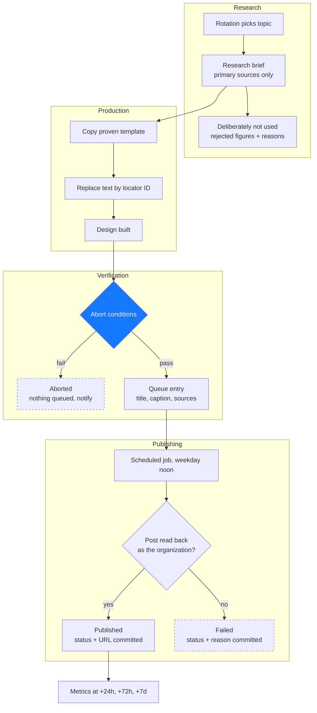

# About the architecture

This page is about why the pipeline is shaped the way it is, and what constrained
it. It is not a guide to operating it — for that, see the
[how-to guides](../how-to/).

## The problem it was built against

A small technology and workforce-development organization needs to be visible on
LinkedIn, and sells technology judgement rather than a product. That combination is
unusually unforgiving. A content pipeline that publishes consistently but says
nothing is a slow reputational cost. One that publishes an invented statistic is a
fast one.

There was no content team and no designer. The pipeline originally economized on one
person's review attention; it now economizes on their involvement entirely, and the
problem it has to solve has changed shape accordingly. Credibility is no longer
protected by someone reading the work before it goes out. It is protected by what the
pipeline refuses to publish.

That shift is the single most important thing to understand about the current design.
Everything below follows from it.

## The shape

```mermaid
flowchart TD
    subgraph Research
        R1[Rotation picks topic] --> R2[Research brief<br/>primary sources only]
        R2 --> R3[Deliberately not used<br/>rejected figures + reasons]
    end
    subgraph Production
        R2 --> P1[Copy proven template]
        P1 --> P2[Replace text by locator ID]
        P2 --> P3[Design built]
    end
    subgraph Verification
        P3 --> V{Abort conditions}
        V -->|fail| X[Aborted<br/>nothing queued, notify]
        V -->|pass| Q[Queue entry<br/>title, caption, sources]
    end
    subgraph Publishing
        Q --> J[Scheduled job, weekday noon]
        J --> RB{Post read back<br/>as the organization?}
        RB -->|yes| PUB[Published<br/>status + URL committed]
        RB -->|no| F[Failed<br/>status + reason committed]
    end
    PUB --> M[Metrics at +24h, +72h, +7d]

    style V fill:#1677FF,color:#fff
    style X stroke-dasharray: 4 4
    style F stroke-dasharray: 4 4
```

Four stages. The gate is now mechanical, and the backward edge still runs from
verification to the research brief rather than to the draft — for the same reason it
always did, discussed below.

## Research before design, and why the arrow points where it does

We separated research into its own artifact with its own standard, and made a failed
check send work back to the *brief* rather than the draft. The reason is that almost
every real failure is a sourcing failure wearing a copywriting costume. A claim reads
as overstated because the underlying figure does not support it. Fixing the sentence
hides the problem; fixing the brief removes it.

This placement matters more now than it did under human review. The brief is no
longer just input to the writing — it is the reference the verification step checks
the finished pages against. A number on a page is legitimate if and only if it is in
the brief. That makes the brief a machine-checkable contract rather than a note to
self, which is what allows the check to be mechanical at all.

The **Deliberately not used** section is the part of this I would carry to any other
project. It is a list of figures that were tempting and were rejected, with reasons.
Without it, a rejected claim comes back. Someone finds the same attractive number six
weeks later, has no memory of the earlier decision, and uses it.

More on this in [About the research standard](research-standard.md).

## Templates rather than generation

The first instinct was to have the design generated fresh each time from a
description. That failed, and the failure is worth recording precisely because it
looked like it should work.

Asking a design generator to produce a page containing copy renders the copy into the
background as raster. The output was unreliable in a way that could not be corrected
— a headline reading `AI-WRITEN`, body text that was not language. The workaround,
generating a text-free background and adding real text elements over it, worked but
was slow: two passes per page, because the text API accepted no formatting.

What worked was building the artifact correctly once, by hand, and turning every
subsequent run into *addressing* it. Page and element identifiers survive a
duplication, so a single locator map drives every carousel thereafter, and replacing
text preserves formatting.

There is a second benefit that only became visible after human review was removed.
Because every carousel is structurally identical to one that a person has already
looked at, the layout is not a thing that can go wrong unsupervised. The checks only
have to interrogate the content.

See [ADR 0002](../adr/0002-generate-text-free-backgrounds.md) and
[ADR 0005](../adr/0005-copy-template-and-replace-text.md), which supersedes it.

## Publishing was the hard part, twice

This is the part that surprised everyone, and the part most worth reading if you are
planning something similar.

The first round: three plausible routes failed, none of them visibly broken from the
outside. The API returned 403 on organization posts for want of a scope. The
platform's own upload dialog exposed no file input, because the button spawns the
operating system's native picker. Scheduling inside the design tool did not exist on
the account. The route that worked was the design tool's share integration, whose
authorization to the page had been granted through a different consent flow than the
one the API needed. The capability was there the whole time, reachable from a
direction nobody had tried.

That route worked and then showed its real cost. It needed a browser, so it needed a
specific machine to be awake; scheduling it meant one task per post on that machine.
In one week, four of five scheduled publishes never fired, and the failures were
silent — the tasks had been placed on hold, the hold expired, and they auto-disabled
without running. Nobody noticed for two weeks, because the log had been written at
scheduling time rather than after a confirmed post.

That is the origin of the rule that a run must read the post back before writing
*Published*. The log had said five posts went out. Two had.

The second round moved publishing to a scheduled job on a CI runner talking directly
to the organization API. It removes the machine, the browser, and the silent-hold
failure mode in one move, and it makes the author a configuration constant rather
than a dropdown that defaults to the wrong value. It costs the property that the
pipeline held no credentials. See
[ADR 0010](../adr/0010-publish-via-github-actions.md).

The generalizable lesson from the first round still stands: integration capability is
not a property of a platform, it is a property of a *path* through a set of
platforms. The lesson from the second is narrower and harder — a route that works is
not the same as a route that keeps working unattended, and the difference only shows
up in the failure log.

## Credentials

The pipeline now holds secrets: an application identifier and secret, a token, and
the organization identifier it publishes as. They live in the CI provider's encrypted
secret store, not in the repository.

This is a real loss. Under the browser route there was no key to leak and no token to
rotate, because authorization was interactive and belonged to a signed-in person. That
was a genuinely better security posture, and it was given up for reliability.

What it buys: the author is now a constant read from configuration rather than a
selection made at run time, which converts the most dangerous step in the old route
into something that cannot be got wrong by a script that is tired.

Two hazards come with it. Tokens expire — where a long-lived token is in use,
publishing stops 60 days after issue and the first symptom is a failed run. And a
secret in a CI job can be printed by an error handler, so the publisher must not log
a token on any path.

## Failure behaviour

Every failure path ends in *stop and report*. None ends in a fallback.

This is now the load-bearing property of the whole system, rather than one design
choice among several. With no human in the publishing path, a run that improvises
past something unexpected is unsupervised by definition. The abort conditions are not
validation in the ordinary sense; they are the only thing standing between a bad
generation and a published post.

So the rules are blunt. A statistic that does not trace to the brief aborts the
carousel — the verification step is explicitly forbidden from substituting an
approximate figure or dropping an attribution to make a page publishable. A queue
entry with no sources is refused outright. The author is never read from the queue.
And a post that cannot be read back is logged as failed, whatever the publish call
returned.

Notification is the other half. An abort is not a silent no-op; without a review
step, the report is the only signal that anything happened at all.

## What the checks do not cover

Worth stating plainly, because the documentation would be dishonest without it.

The checks verify that every figure traces to a source. They do not verify that the
sentence above the figure fairly characterizes it. The one correction this pipeline's
review step ever caught was exactly that kind: a page read "government impersonation
doubled" against an underlying 1.87×. Every element was present and correctly
attributed. The claim was still wrong.

A mechanical check matching numbers to a brief would have passed that page.

The mitigation is upstream, in the research standard: briefs record figures as the
source states them, so a carousel that quotes the brief closely inherits its
accuracy. That narrows the gap. It does not close it. The residual risk is a page
that is fully sourced and still mischaracterized, and it is accepted knowingly.

See [About the verification model](verification-model.md) and
[ADR 0009](../adr/0009-automated-checks-replace-approval-gate.md).

## What was deliberately not built

**A twice-daily cadence.** Briefly run and reverted. The binding constraint is
research, which is the slowest stage and the one that cannot be compressed without
thinning the briefs — and a well-designed carousel on a thin brief is worse than
nothing, because it looks authoritative. Five weekdays is where it settled. See
[ADR 0011](../adr/0011-five-posts-per-week.md).

**Engagement-driven topic selection.** The sample is far too small. Across the first
month there were two published posts, five followers, and 64 impressions. Any content
conclusion drawn from that is noise, and the reporting prompt says so in its own
constraints. See [About the analytics](analytics.md).

## Related

- [About the research standard](research-standard.md)
- [About the verification model](verification-model.md)
- [About the analytics](analytics.md)
- [The decision log](../adr/)
